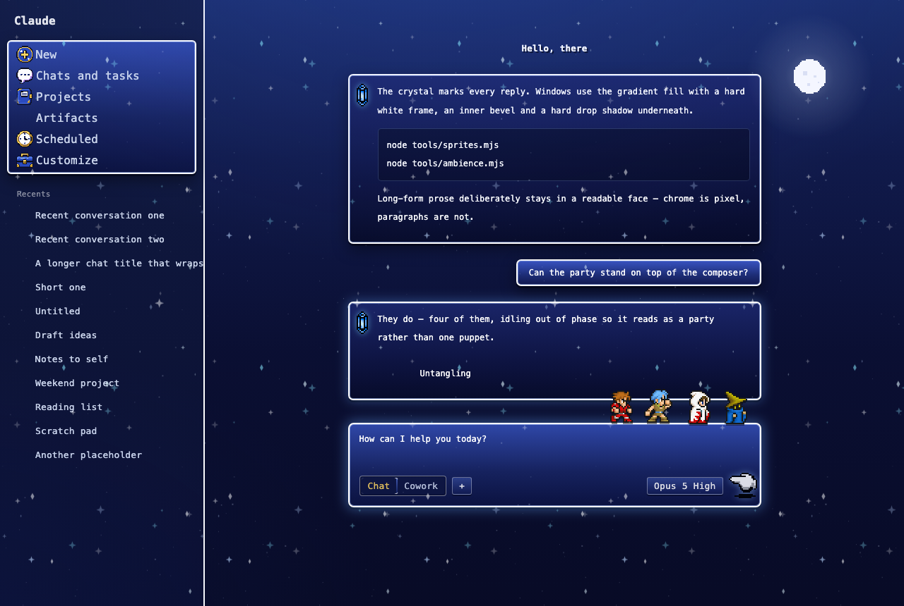
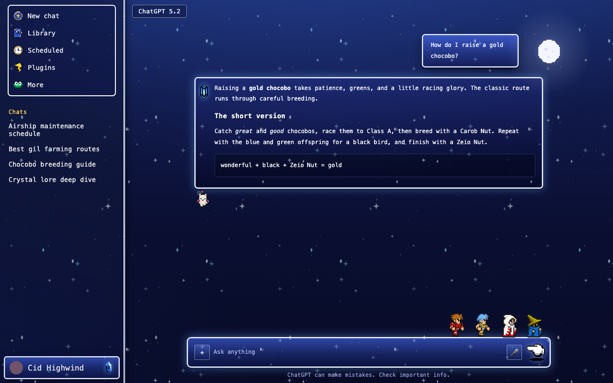
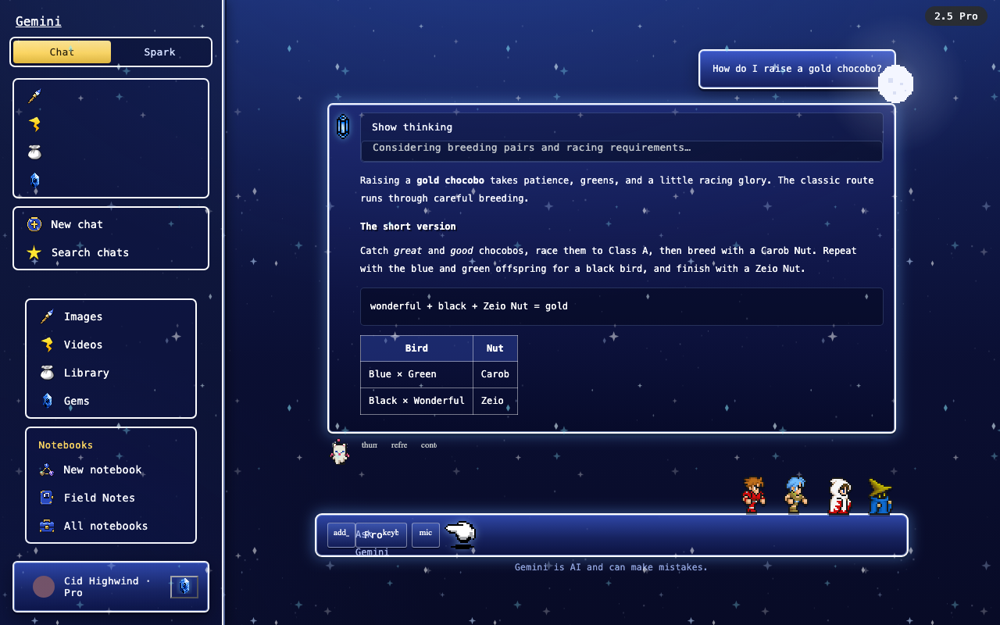

# Yume Forge Modified — Claude, ChatGPT & Gemini Themes

Themes for **claude.ai**, **chatgpt.com** and **gemini.google.com**, in one
Chrome extension.

| claude.ai | chatgpt.com | gemini.google.com |
| :---: | :---: | :---: |
|  |  |  |

The 💎 Final Fantasy theme on all three sites — rendered from the offline
harnesses in `tools/`, so the pictures carry sample data, not anyone's chats.

A fork of [Yume Themes for Claude](https://chromewebstore.google.com/detail/ipfkpkhddkhndibomlaklpfaikjfdlgb)
(by Mohamed El-Harras) with:

- **A Final Fantasy theme for each site** — royal-blue menu windows with white
  frames, pixel fonts, a crystal beside every reply, a four-person party idling
  on the message box, a moogle who supervises the replies, menu sounds, and the
  occasional chocobo drive-by. One 💎 card per popup tab, ported separately to
  each site's own markup: all of claude.ai (Home and the Code tab), chatgpt.com,
  and gemini.google.com (the Chat and Spark surfaces alike).
- **Claude / OpenAI / Gemini tabs in the popup** — each site keeps its own
  selected theme, so you can run Final Fantasy on all three, or mix and match.
- **Import / export / share** — every theme card has a **⤓** button that
  saves a self-contained file and copies a share code. Import a file, a
  pasted code, or a zip of either.
- The original's 24 Claude themes, untouched. They're written against
  claude.ai's own markup, so they stay on the Claude tab — the OpenAI and
  Gemini tabs each hold that site's Final Fantasy card alone. 27 bundled
  themes in all.

## Install (Chrome)

1. Download **`yume-forge-modified.zip`** from the
   [latest release](https://github.com/icpryde/yume-forge-modified/releases/latest)
   and **unzip it**.
2. If you have the original *Yume Themes for Claude* (or an older copy of
   this) installed, remove or disable it first.
3. Open `chrome://extensions` in Chrome.
4. Turn on **Developer mode** (toggle in the top right).
5. Click **Load unpacked** and pick the unzipped `yume-forge-modified` folder.
6. Open (or reload) claude.ai, chatgpt.com or gemini.google.com, click the
   extension's icon, and pick a theme — use the **Claude / OpenAI / Gemini**
   tabs at the top of the popup to choose which site you're theming.

Also works in Arc and other Chromium browsers — use `arc://extensions` (or the
equivalent) instead in step 3.

Because it's loaded unpacked it never auto-updates: to update, download the
new zip, replace the folder, and press **↻** on the extension's card.

### Theme settings

Cards with options show a **⚙** — each Final Fantasy card has three: colourful
text, menu sounds, and the horizon scenery. The chocobo buttons in there send
one to the open tab for that card's site; left alone, he visits on his own
every few minutes.

## Sharing themes

**⤓** on any card saves a `.yume.json` file and copies a `YUME1:` code —
send either one. **📥 Import a theme** (or **Paste code**) brings one in;
imports are self-contained (sprites, fonts and sounds travel inside the file)
and never overwrite your existing themes. A shared theme carries the site it
was built for, so an imported Claude / ChatGPT / Gemini theme lands under the
right popup tab and never overwrites another site's selection; older builds
simply ignore the field.

## Trust notes (what changed from the store version)

- The store version's background service worker — which fetched CSS from a
  remote repo every 6 hours and injected it into claude.ai — is **removed**.
  Nothing remote ever lands in your sessions.
- It runs on three hosts and nowhere else — claude.ai, chatgpt.com and
  gemini.google.com — declared in the manifest; there is no `<all_urls>`
  match and no host permission beyond those three.
- Permissions are just `storage`.
- Theme files are data-only: nothing a theme contains can execute.

## For developers

`node tools/pack-theme.mjs final-fantasy final-fantasy-gpt final-fantasy-gemini`
writes the shareable `dist/<id>.yume.json` + `.yume.txt` exports (those three
are the ones worth packaging; `--all` does every bundled theme).
`node tools/check.mjs` runs the suites (engine, content-script smoke drives for
all three sites, glyph states, packaged-theme round-trips, popup, zip) — the
popup and zip suites skip until `dist/final-fantasy.yume.json` and
`release/yume-forge-modified.zip` exist; check.mjs prints the exact command that
makes them. `node tools/package.mjs --out ./release` builds the shareable zip.
`tools/mock.html`, `tools/gpt-mock.html` and `tools/gemini-mock.html` render the
theme against stand-in markup for each site for visual iteration offline (the
README screenshots come from these; the headless smoke fixtures live inside
`tools/smoke.mjs`). The theme studio
(chrome://extensions → Details → Extension options) edits and creates themes; it
has no site picker, so a theme you create there is a Claude one (imported and
duplicated themes keep the site they came with).
The asset generators and their sources are documented in `tools/` — the
generated `sprites/*.css` files each name the tool that wrote them.

## Credits

- Original extension by **Mohamed El-Harras**.
- **Press Start 2P** © 2012 CodeMan38, **Silkscreen** © 2001 Jason Kottke —
  both SIL Open Font License 1.1 (`fonts/OFL.txt`).

This is an unofficial, non-commercial fan project. Final Fantasy and related
names and characters are trademarks or copyrighted works of their respective
owners. This project is not affiliated with or endorsed by Square Enix,
Anthropic, OpenAI or Google.
